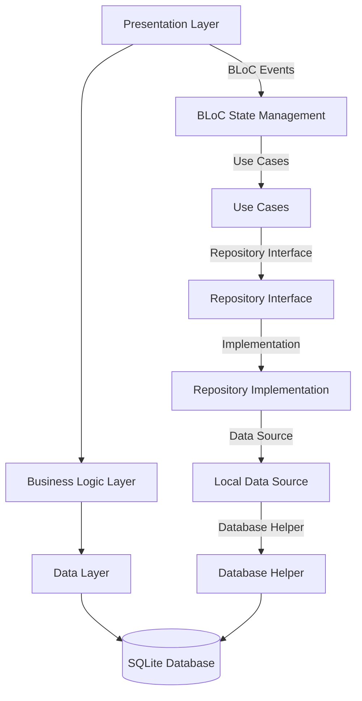

# Technical Specification - Up Todo Flutter Application

## Document Information
- **Document Type**: Technical Specification
- **Version**: 1.0.0
- **Last Updated**: January 2025
- **Application**: Up Todo - Flutter Task Management App

---

## Table of Contents
1. [System Architecture](#system-architecture)
2. [Database Design Specification](#database-design-specification)
3. [API Specifications](#api-specifications)
4. [State Management Specification](#state-management-specification)
5. [Component Specifications](#component-specifications)
6. [Data Models & Schemas](#data-models--schemas)
7. [Business Logic Specifications](#business-logic-specifications)
8. [UI/UX Technical Specifications](#uiux-technical-specifications)
9. [Performance Requirements](#performance-requirements)
10. [Security Specifications](#security-specifications)

---

## System Architecture

### 1.1 High-Level Architecture



### 1.2 Layer Dependencies

```dart
// Dependency flow (Clean Architecture)
Presentation Layer --> Domain Layer
Data Layer --> Domain Layer  
Core Layer --> Framework Dependencies

// Forbidden dependencies:
// Domain Layer --> Presentation Layer ❌
// Domain Layer --> Data Layer ❌
// Presentation Layer --> Data Layer ❌
```

### 1.3 Module Structure

```
lib/
├── main.dart                           # Entry point & DI setup
├── core/                              # Shared infrastructure
│   ├── database/                      # Database configuration
│   │   └── database_helper.dart       # SQLite management singleton
│   └── utils/                         # Shared utilities
│       ├── colors.dart                # Color constants
│       ├── constants.dart             # App constants & categories
│       ├── images.dart                # Asset path constants
│       └── theme/                     # Theme configuration
│           ├── theme.dart             # Main theme
│           └── custom-theme/          # Component themes
│               ├── app_bar_theme.dart
│               ├── check_box_theme.dart
│               ├── chip_theme.dart
│               ├── elevated_button_theme.dart
│               ├── outline_button_theme.dart
│               ├── text_field_theme.dart
│               └── text_theme.dart
└── features/                          # Feature modules
    ├── splash/                        # Splash screen
    │   └── splash.dart
    └── tasks/                         # Task management
        ├── data/                      # Data layer
        │   ├── datasources/           # Data source contracts & implementations
        │   │   └── task_local_datasource.dart
        │   ├── models/                # Data models with serialization
        │   │   └── task_model.dart
        │   └── repositories/          # Repository implementations
        │       └── task_repository_impl.dart
        ├── domain/                    # Business logic
        │   ├── entities/              # Business entities
        │   │   └── task.dart
        │   ├── repositories/          # Repository contracts
        │   │   └── task_repository.dart
        │   └── usecases/              # Business use cases
        │       ├── add_task.dart
        │       ├── delete_task.dart
        │       ├── get_tasks.dart
        │       └── update_task.dart
        └── presentation/              # UI layer
            ├── bloc/                  # State management
            │   ├── category_bloc.dart
            │   ├── category_event.dart
            │   ├── category_state.dart
            │   ├── task_bloc.dart
            │   ├── task_event.dart
            │   └── task_state.dart
            ├── screens/               # Main screens
            │   ├── add_task_screen.dart
            │   └── task_screen.dart
            └── widgets/               # Reusable components
                ├── categories_dialog.dart
                ├── filter_bottomsheet.dart
                ├── no_task.dart
                └── task_card.dart
```

---

## Database Design Specification

### 2.1 Database Configuration

```dart
class DatabaseHelper {
  static Database? _database;
  static const String _databaseName = 'tasks.db';
  static const int _databaseVersion = 2;
  static const String tasksTableName = 'tasks';
  static const String categoriesTableName = 'categories';
}
```

### 2.2 Table Schemas

#### Tasks Table Schema
```sql
CREATE TABLE tasks (
  id INTEGER PRIMARY KEY AUTOINCREMENT,    -- Auto-increment primary key
  title TEXT NOT NULL,                     -- Task title (required)
  category TEXT NOT NULL,                  -- Category name (FK to categories.name)
  priority INTEGER NOT NULL,               -- Priority level 1-5 (1=highest)
  date TEXT NOT NULL,                      -- Due date in YYYY-MM-DD format
  isCompleted INTEGER NOT NULL DEFAULT 0,  -- Boolean as INTEGER (0=false, 1=true)
  createdAt TEXT NOT NULL                  -- ISO 8601 timestamp
);
```

**Constraints & Indexes:**
- Primary Key: `id`
- Foreign Key: `category` references `categories.name`
- Index on `category` for efficient filtering
- Index on `date` for date-based queries
- Index on `isCompleted` for completion filtering

#### Categories Table Schema
```sql
CREATE TABLE categories (
  id INTEGER PRIMARY KEY AUTOINCREMENT,    -- Auto-increment primary key  
  name TEXT NOT NULL UNIQUE,               -- Category name (unique constraint)
  iconCodePoint INTEGER NOT NULL,          -- Material Icon code point
  colorValue INTEGER NOT NULL,             -- ARGB color value
  isCustom INTEGER NOT NULL DEFAULT 1,     -- 0=default category, 1=custom
  createdAt TEXT NOT NULL,                 -- Creation timestamp
  updatedAt TEXT NOT NULL                  -- Last modification timestamp
);
```

**Constraints & Indexes:**
- Primary Key: `id`
- Unique Constraint: `name`
- Index on `isCustom` for filtering default vs custom categories

### 2.3 Data Types & Serialization

#### DateTime Serialization
```dart
// Storage format
date: DateFormat('yyyy-MM-dd').format(date)           // Due dates
createdAt: DateTime.now().toIso8601String()          // Timestamps

// Retrieval format
date: DateTime.parse(map['date'])
createdAt: DateTime.parse(map['createdAt'])
```

#### Boolean Serialization
```dart
// Dart bool to SQLite INTEGER
isCompleted: task.isCompleted ? 1 : 0

// SQLite INTEGER to Dart bool
isCompleted: map['isCompleted'] == 1
```

#### Color & Icon Serialization
```dart
// Icon storage
iconCodePoint: Icons.shopping_cart.codePoint

// Icon retrieval
icon: IconData(map['iconCodePoint'], fontFamily: 'MaterialIcons')

// Color storage
colorValue: const Color(0xFF66BB6A).value

// Color retrieval  
color: Color(map['colorValue'])
```

### 2.4 Default Data

#### Predefined Categories
```dart
final defaultCategories = [
  {
    'name': 'Grocery',
    'iconCodePoint': Icons.shopping_cart.codePoint,
    'colorValue': const Color(0xFF66BB6A).value,
    'isCustom': 0,
  },
  {
    'name': 'Work', 
    'iconCodePoint': Icons.work.codePoint,
    'colorValue': const Color(0xFFEF5350).value,
    'isCustom': 0,
  },
  // ... 7 more default categories
];
```

### 2.5 Database Operations Specification

#### CRUD Operations Interface
```dart
abstract class TaskLocalDataSource {
  Future<List<TaskModel>> getTasks();
  Future<int> addTask(TaskModel task);
  Future<int> updateTask(TaskModel task);  
  Future<int> deleteTask(int id);
}

abstract class CategoryDataSource {
  Future<List<Map<String, dynamic>>> getCategories();
  Future<int> insertCategory({
    required String name,
    required int iconCodePoint, 
    required int colorValue,
    bool isCustom = true,
  });
  Future<int> updateCategory({
    required int id,
    String? name,
    int? iconCodePoint,
    int? colorValue,
  });
  Future<int> deleteCategory(String name);
}
```

### 2.6 Migration Strategy
```dart
Future<void> _onUpgrade(Database db, int oldVersion, int newVersion) async {
  if (oldVersion < 2) {
    // Version 1 → 2: Add categories table
    await db.execute('''
      CREATE TABLE categories (
        id INTEGER PRIMARY KEY AUTOINCREMENT,
        name TEXT NOT NULL UNIQUE,
        iconCodePoint INTEGER NOT NULL,
        colorValue INTEGER NOT NULL,
        isCustom INTEGER NOT NULL DEFAULT 1,
        createdAt TEXT NOT NULL,
        updatedAt TEXT NOT NULL
      )
    ''');
    
    await _insertDefaultCategories(db);
  }
  
  // Future migrations can be added here
  // if (oldVersion < 3) { ... }
}
```

---

## API Specifications

### 3.1 Repository Interface Specification

#### TaskRepository Contract
```dart
abstract class TaskRepository {
  /// Retrieves all tasks from data source
  /// Returns: List of Task entities
  /// Throws: RepositoryException on data access error
  Future<List<Task>> getTasks();
  
  /// Adds a new task to data source
  /// Parameters: Task entity to add
  /// Throws: RepositoryException on validation or storage error
  Future<void> addTask(Task task);
  
  /// Updates an existing task in data source
  /// Parameters: Task entity with updated values
  /// Throws: RepositoryException if task not found or update fails
  Future<void> updateTask(Task task);
  
  /// Deletes a task from data source
  /// Parameters: Task ID to delete
  /// Throws: RepositoryException if task not found or deletion fails
  Future<void> deleteTask(int id);
}
```

### 3.2 Use Case Specifications

#### GetTasks Use Case
```dart
class GetTasks {
  final TaskRepository repository;
  
  GetTasks(this.repository);
  
  /// Executes the get tasks use case
  /// Returns: List of Task entities sorted by creation date (newest first)
  /// Business Rules:
  /// - Returns all tasks regardless of completion status
  /// - Sorts by createdAt in descending order
  /// - Includes category information
  Future<List<Task>> call() async {
    try {
      final tasks = await repository.getTasks();
      // Sort by creation date, newest first
      tasks.sort((a, b) => b.createdAt.compareTo(a.createdAt));
      return tasks;
    } catch (e) {
      throw UseCaseException('Failed to retrieve tasks: $e');
    }
  }
}
```

#### AddTask Use Case  
```dart
class AddTask {
  final TaskRepository repository;
  
  AddTask(this.repository);
  
  /// Executes the add task use case
  /// Parameters: Task entity to add
  /// Business Rules:
  /// - Title must not be empty
  /// - Category must exist in categories table
  /// - Priority must be between 1-5
  /// - Due date cannot be null
  /// - Sets createdAt to current timestamp
  Future<void> call(Task task) async {
    // Validation
    if (task.title.trim().isEmpty) {
      throw ValidationException('Task title cannot be empty');
    }
    
    if (task.priority < 1 || task.priority > 5) {
      throw ValidationException('Priority must be between 1 and 5');
    }
    
    // Set creation timestamp
    final taskWithTimestamp = task.copyWith(
      createdAt: DateTime.now(),
    );
    
    try {
      await repository.addTask(taskWithTimestamp);
    } catch (e) {
      throw UseCaseException('Failed to add task: $e');
    }
  }
}
```

#### UpdateTask Use Case
```dart
class UpdateTask {
  final TaskRepository repository;
  
  UpdateTask(this.repository);
  
  /// Executes the update task use case
  /// Parameters: Task entity with updated values
  /// Business Rules:
  /// - Task ID must exist
  /// - Title validation if changed
  /// - Category validation if changed
  /// - Priority validation if changed
  Future<void> call(Task task) async {
    if (task.id == null) {
      throw ValidationException('Task ID is required for update');
    }
    
    // Validation for updated fields
    if (task.title.trim().isEmpty) {
      throw ValidationException('Task title cannot be empty');
    }
    
    if (task.priority < 1 || task.priority > 5) {
      throw ValidationException('Priority must be between 1 and 5');
    }
    
    try {
      await repository.updateTask(task);
    } catch (e) {
      throw UseCaseException('Failed to update task: $e');
    }
  }
}
```

#### DeleteTask Use Case
```dart
class DeleteTask {
  final TaskRepository repository;
  
  DeleteTask(this.repository);
  
  /// Executes the delete task use case
  /// Parameters: Task ID to delete
  /// Business Rules:
  /// - Task ID must exist
  /// - Deletion is permanent (no soft delete)
  Future<void> call(int id) async {
    if (id <= 0) {
      throw ValidationException('Invalid task ID');
    }
    
    try {
      await repository.deleteTask(id);
    } catch (e) {
      throw UseCaseException('Failed to delete task: $e');
    }
  }
}
```

---

## State Management Specification

### 4.1 BLoC Architecture

#### TaskBloc State Management
```dart
class TaskBloc extends Bloc<TaskEvent, TaskState> {
  final GetTasks getTasks;
  final AddTask addTask;
  final UpdateTask updateTask;
  final DeleteTask deleteTask;
  
  TaskBloc({
    required this.getTasks,
    required this.addTask,
    required this.updateTask,
    required this.deleteTask,
  }) : super(TaskInitial()) {
    on<LoadTasks>(_onLoadTasks);
    on<AddTaskEvent>(_onAddTask);
    on<UpdateTaskEvent>(_onUpdateTask);
    on<DeleteTaskEvent>(_onDeleteTask);
    on<ToggleTaskCompletion>(_onToggleTaskCompletion);
    on<SearchTaskEvent>(_onSearchTasks);
    on<ApplyFiltersEvent>(_onApplyFilters);
    on<ClearFiltersEvent>(_onClearFilters);
  }
}
```

### 4.2 Event Specifications

```dart
abstract class TaskEvent extends Equatable {
  const TaskEvent();
  
  @override
  List<Object?> get props => [];
}

/// Event to load all tasks from repository
class LoadTasks extends TaskEvent {}

/// Event to add a new task
class AddTaskEvent extends TaskEvent {
  final Task task;
  
  const AddTaskEvent(this.task);
  
  @override
  List<Object> get props => [task];
}

/// Event to update an existing task
class UpdateTaskEvent extends TaskEvent {
  final Task task;
  
  const UpdateTaskEvent(this.task);
  
  @override
  List<Object> get props => [task];
}

/// Event to delete a task by ID
class DeleteTaskEvent extends TaskEvent {
  final int id;
  
  const DeleteTaskEvent(this.id);
  
  @override
  List<Object> get props => [id];
}

/// Event to toggle task completion status
class ToggleTaskCompletion extends TaskEvent {
  final Task task;
  
  const ToggleTaskCompletion(this.task);
  
  @override
  List<Object> get props => [task];
}

/// Event to search tasks by query string
class SearchTaskEvent extends TaskEvent {
  final String query;
  
  const SearchTaskEvent(this.query);
  
  @override
  List<Object> get props => [query];
}

/// Event to apply filters to task list
class ApplyFiltersEvent extends TaskEvent {
  final TaskFilter filter;
  
  const ApplyFiltersEvent(this.filter);
  
  @override
  List<Object> get props => [filter];
}

/// Event to clear all applied filters
class ClearFiltersEvent extends TaskEvent {}
```

### 4.3 State Specifications

```dart
abstract class TaskState extends Equatable {
  const TaskState();
  
  @override
  List<Object?> get props => [];
}

/// Initial state when BLoC is first created
class TaskInitial extends TaskState {}

/// State indicating tasks are being loaded
class TaskLoading extends TaskState {}

/// State containing loaded tasks and applied filters
class TaskLoaded extends TaskState {
  final List<Task> allTasks;           // Complete unfiltered task list
  final List<Task> filteredTasks;      // Tasks after applying filters/search
  final String searchQuery;            // Current search query
  final TaskFilter activeFilter;       // Currently applied filters
  
  const TaskLoaded(
    this.allTasks, {
    List<Task>? filteredTasks,
    this.searchQuery = '',
    this.activeFilter = const TaskFilter(),
  }) : filteredTasks = filteredTasks ?? allTasks;
  
  /// Creates a copy of this state with updated values
  TaskLoaded copyWith({
    List<Task>? allTasks,
    List<Task>? filteredTasks, 
    String? searchQuery,
    TaskFilter? activeFilter,
  }) {
    return TaskLoaded(
      allTasks ?? this.allTasks,
      filteredTasks: filteredTasks ?? this.filteredTasks,
      searchQuery: searchQuery ?? this.searchQuery,
      activeFilter: activeFilter ?? this.activeFilter,
    );
  }
  
  @override
  List<Object?> get props => [allTasks, filteredTasks, searchQuery, activeFilter];
}

/// State indicating an error occurred
class TaskError extends TaskState {
  final String message;
  
  const TaskError(this.message);
  
  @override
  List<Object> get props => [message];
}
```

### 4.4 Filter Specifications

```dart
class TaskFilter extends Equatable {
  final int? priority;              // Priority level filter (1-5)
  final String? category;           // Category name filter
  final DateFilterType? dateFilter; // Date range filter type
  final DateTime? specificDate;     // Specific date for filtering
  
  const TaskFilter({
    this.priority,
    this.category,
    this.dateFilter,
    this.specificDate,
  });
  
  /// Creates a copy with updated filter values
  TaskFilter copyWith({
    int? priority,
    String? category,
    DateFilterType? dateFilter,
    DateTime? specificDate,
  }) {
    return TaskFilter(
      priority: priority ?? this.priority,
      category: category ?? this.category,
      dateFilter: dateFilter ?? this.dateFilter,
      specificDate: specificDate ?? this.specificDate,
    );
  }
  
  /// Returns true if any filters are applied
  bool get hasFilters =>
      priority != null ||
      category != null ||
      dateFilter != null ||
      specificDate != null;
  
  @override
  List<Object?> get props => [priority, category, dateFilter, specificDate];
}

enum DateFilterType {
  today,        // Tasks due today
  tomorrow,     // Tasks due tomorrow
  thisWeek,     // Tasks due this week (Monday-Sunday)
  thisMonth,    // Tasks due this month
  overdue,      // Tasks past due and not completed
  specific,     // Tasks due on specific date
}
```

### 4.5 Category BLoC Specification

```dart
class CategoryBloc extends Bloc<CategoryEvent, CategoryState> {
  List<CategoryItem> _categories = [];
  final DatabaseHelper _dbHelper = DatabaseHelper();
  
  CategoryBloc() : super(CategoryInitial()) {
    on<LoadCategories>(_onLoadCategories);
    on<AddCategory>(_onAddCategory);
    on<DeleteCategory>(_onDeleteCategory);
    on<UpdateCategory>(_onUpdateCategory);
  }
}

// Category Events
abstract class CategoryEvent extends Equatable {}

class LoadCategories extends CategoryEvent {
  @override
  List<Object> get props => [];
}

class AddCategory extends CategoryEvent {
  final String name;
  final IconData icon;
  final Color color;
  
  AddCategory({
    required this.name,
    required this.icon,
    required this.color,
  });
  
  @override
  List<Object> get props => [name, icon, color];
}

class DeleteCategory extends CategoryEvent {
  final String categoryName;
  
  DeleteCategory(this.categoryName);
  
  @override
  List<Object> get props => [categoryName];
}

class UpdateCategory extends CategoryEvent {
  final String oldName;
  final String newName;
  final IconData? newIcon;
  final Color? newColor;
  
  UpdateCategory({
    required this.oldName,
    required this.newName,
    this.newIcon,
    this.newColor,
  });
  
  @override
  List<Object?> get props => [oldName, newName, newIcon, newColor];
}

// Category States
abstract class CategoryState extends Equatable {}

class CategoryInitial extends CategoryState {
  @override
  List<Object> get props => [];
}

class CategoryLoading extends CategoryState {
  @override
  List<Object> get props => [];
}

class CategoryLoaded extends CategoryState {
  final List<CategoryItem> categories;
  
  const CategoryLoaded(this.categories);
  
  @override
  List<Object> get props => [categories];
}

class CategoryError extends CategoryState {
  final String message;
  
  const CategoryError(this.message);
  
  @override
  List<Object> get props => [message];
}
```

---

## Component Specifications

### 5.1 TaskCard Widget Specification

```dart
class TaskCard extends StatelessWidget {
  final Task task;
  
  const TaskCard({
    super.key,
    required this.task,
  });
  
  @override
  Widget build(BuildContext context) {
    return Container(
      margin: const EdgeInsets.only(bottom: 12),
      padding: const EdgeInsets.all(16),
      decoration: BoxDecoration(
        color: const Color(0xFF1E1E1E),      // Dark card background
        borderRadius: BorderRadius.circular(8),
        border: Border.all(
          color: const Color(0xFF333333),     // Subtle border
          width: 1,
        ),
      ),
      child: Row(
        children: [
          // Completion checkbox
          _buildCompletionCheckbox(context),
          const SizedBox(width: 12),
          
          // Task content
          Expanded(
            child: _buildTaskContent(context),
          ),
          
          // Delete button
          _buildDeleteButton(context),
        ],
      ),
    );
  }
}
```

**TaskCard Features:**
- Completion status checkbox with animation
- Category color indicator
- Priority level visualization
- Due date formatting with overdue highlighting
- Delete functionality with confirmation dialog
- Responsive layout adaptation

### 5.2 FilterBottomSheet Specification

```dart
class FilterBottomSheet extends StatefulWidget {
  final TaskFilter currentFilter;
  
  const FilterBottomSheet({
    super.key,
    required this.currentFilter,
  });
  
  static Future<TaskFilter?> show(
    BuildContext context,
    TaskFilter currentFilter,
  ) {
    return showModalBottomSheet<TaskFilter>(
      context: context,
      isScrollControlled: true,
      backgroundColor: Colors.transparent,
      builder: (context) => FilterBottomSheet(
        currentFilter: currentFilter,
      ),
    );
  }
}
```

**FilterBottomSheet Features:**
- Priority level selection (1-5 chips)
- Category selection grid with color coding
- Date filter options (Today, Tomorrow, This Week, etc.)
- Specific date picker integration
- Apply/Clear filter actions
- Real-time filter preview

### 5.3 CategoryDialog Specification

```dart
class CategoryDialog extends StatelessWidget {
  final String? selectedCategory;
  final Function(CategoryItem category) onCategorySelected;
  
  const CategoryDialog({
    super.key,
    this.selectedCategory,
    required this.onCategorySelected,
  });
  
  static Future<CategoryItem?> show(
    BuildContext context, {
    String? selectedCategory,
    required Function(CategoryItem category) onCategorySelected,
  }) {
    return showDialog<CategoryItem>(
      context: context,
      barrierColor: Colors.black.withOpacity(0.7),
      builder: (context) => BlocProvider(
        create: (context) => CategoryBloc()..add(LoadCategories()),
        child: CategoryDialog(
          selectedCategory: selectedCategory,
          onCategorySelected: onCategorySelected,
        ),
      ),
    );
  }
}
```

**CategoryDialog Features:**
- Grid layout for category selection
- Visual selection indicators
- Add custom category functionality
- Icon selection from Material Icons
- Color picker for custom categories
- BLoC integration for category management

### 5.4 AddTaskScreen Specification

```dart
class AddTaskScreen extends StatefulWidget {
  const AddTaskScreen({super.key});
  
  @override
  State<AddTaskScreen> createState() => _AddTaskScreenState();
}

class _AddTaskScreenState extends State<AddTaskScreen> {
  final _titleController = TextEditingController();
  DateTime _selectedDate = DateTime.now();
  CategoryItem _selectedCategory = CategoryConstants.categories.first;
  int _selectedPriority = 1;
  
  @override
  void dispose() {
    _titleController.dispose();
    super.dispose();
  }
}
```

**AddTaskScreen Features:**
- Form validation with error handling
- Date picker with date formatting
- Category selection dialog integration
- Priority level selector (1-5)
- Task creation with BLoC integration
- Navigation handling and form reset

---

## Data Models & Schemas

### 6.1 Task Entity Specification

```dart
class Task extends Equatable {
  final int? id;              // Unique identifier (null for new tasks)
  final String title;         // Task title/description (required)
  final String category;      // Category name (FK reference)
  final int priority;         // Priority level 1-5 (1=highest)
  final DateTime date;        // Due date (required)
  final bool isCompleted;     // Completion status
  final DateTime createdAt;   // Creation timestamp
  
  const Task({
    this.id,
    required this.title,
    required this.category,
    required this.priority,
    required this.date,
    required this.isCompleted,
    required this.createdAt,
  });
  
  /// Creates a copy of this task with updated values
  Task copyWith({
    int? id,
    String? title,
    String? category,
    int? priority,
    DateTime? date,
    bool? isCompleted,
    DateTime? createdAt,
  }) {
    return Task(
      id: id ?? this.id,
      title: title ?? this.title,
      category: category ?? this.category,
      priority: priority ?? this.priority,
      date: date ?? this.date,
      isCompleted: isCompleted ?? this.isCompleted,
      createdAt: createdAt ?? this.createdAt,
    );
  }
  
  @override
  List<Object?> get props => [
    id, title, category, priority, date, isCompleted, createdAt
  ];
}
```

### 6.2 TaskModel Specification (Data Layer)

```dart
class TaskModel extends Task {
  const TaskModel({
    super.id,
    required super.title,
    required super.category,
    required super.priority,
    required super.date,
    required super.isCompleted,
    required super.createdAt,
  });
  
  /// Converts Task entity to database map
  Map<String, dynamic> toMap() {
    return {
      'id': id,
      'title': title,
      'category': category,
      'priority': priority,
      'date': DateFormat('yyyy-MM-dd').format(date),
      'isCompleted': isCompleted ? 1 : 0,
      'createdAt': createdAt.toIso8601String(),
    };
  }
  
  /// Creates TaskModel from database map
  factory TaskModel.fromMap(Map<String, dynamic> map) {
    return TaskModel(
      id: map['id'],
      title: map['title'],
      category: map['category'],
      priority: map['priority'],
      date: DateTime.parse(map['date']),
      isCompleted: map['isCompleted'] == 1,
      createdAt: DateTime.parse(map['createdAt']),
    );
  }
  
  /// Converts TaskModel to Task entity
  Task toEntity() {
    return Task(
      id: id,
      title: title,
      category: category,
      priority: priority,
      date: date,
      isCompleted: isCompleted,
      createdAt: createdAt,
    );
  }
  
  /// Creates TaskModel from Task entity
  factory TaskModel.fromEntity(Task task) {
    return TaskModel(
      id: task.id,
      title: task.title,
      category: task.category,
      priority: task.priority,
      date: task.date,
      isCompleted: task.isCompleted,
      createdAt: task.createdAt,
    );
  }
}
```

### 6.3 CategoryItem Specification

```dart
class CategoryItem extends Equatable {
  final String name;          // Category name identifier
  final IconData icon;        // Material Design icon
  final Color color;          // Theme color for category
  
  const CategoryItem({
    required this.name,
    required this.icon,
    required this.color,
  });
  
  /// Creates a copy with updated values
  CategoryItem copyWith({
    String? name,
    IconData? icon,
    Color? color,
  }) {
    return CategoryItem(
      name: name ?? this.name,
      icon: icon ?? this.icon,
      color: color ?? this.color,
    );
  }
  
  @override
  List<Object> get props => [name, icon, color];
}
```

---

## Business Logic Specifications

### 7.1 Filtering Algorithm

```dart
/// Applies search query and filters to task list
List<Task> _applyFiltersAndSearch(
  List<Task> allTasks,
  String searchQuery,
  TaskFilter filter,
) {
  return allTasks.where((task) {
    // Apply search filter
    if (searchQuery.isNotEmpty) {
      final titleMatch = task.title
          .toLowerCase()
          .contains(searchQuery.toLowerCase());
      if (!titleMatch) return false;
    }
    
    // Apply priority filter
    if (filter.priority != null) {
      if (task.priority != filter.priority) return false;
    }
    
    // Apply category filter
    if (filter.category != null) {
      if (task.category != filter.category) return false;
    }
    
    // Apply date filters
    if (filter.dateFilter != null) {
      switch (filter.dateFilter!) {
        case DateFilterType.today:
          return _isToday(task.date);
        case DateFilterType.tomorrow:
          return _isTomorrow(task.date);
        case DateFilterType.thisWeek:
          return _isThisWeek(task.date);
        case DateFilterType.thisMonth:
          return _isThisMonth(task.date);
        case DateFilterType.overdue:
          return _isOverdue(task);
        case DateFilterType.specific:
          if (filter.specificDate == null) return false;
          return _isSameDay(task.date, filter.specificDate!);
      }
    }
    
    return true;
  }).toList();
}
```

### 7.2 Date Helper Functions

```dart
/// Checks if date is today
bool _isToday(DateTime date) {
  final now = DateTime.now();
  return date.year == now.year && 
         date.month == now.month && 
         date.day == now.day;
}

/// Checks if date is tomorrow
bool _isTomorrow(DateTime date) {
  final tomorrow = DateTime.now().add(const Duration(days: 1));
  return date.year == tomorrow.year && 
         date.month == tomorrow.month && 
         date.day == tomorrow.day;
}

/// Checks if date is within current week (Monday-Sunday)
bool _isThisWeek(DateTime date) {
  final now = DateTime.now();
  final weekStart = now.subtract(Duration(days: now.weekday - 1));
  final weekEnd = weekStart.add(const Duration(days: 6));
  
  return date.isAfter(weekStart.subtract(const Duration(days: 1))) &&
         date.isBefore(weekEnd.add(const Duration(days: 1)));
}

/// Checks if date is within current month
bool _isThisMonth(DateTime date) {
  final now = DateTime.now();
  return date.year == now.year && date.month == now.month;
}

/// Checks if task is overdue (past due and not completed)
bool _isOverdue(Task task) {
  final now = DateTime.now();
  final taskDate = DateTime(task.date.year, task.date.month, task.date.day);
  final today = DateTime(now.year, now.month, now.day);
  
  return taskDate.isBefore(today) && !task.isCompleted;
}

/// Checks if two dates are the same day
bool _isSameDay(DateTime date1, DateTime date2) {
  return date1.year == date2.year &&
         date1.month == date2.month &&
         date1.day == date2.day;
}
```

### 7.3 Validation Rules

#### Task Validation
```dart
class TaskValidator {
  static ValidationResult validateTask(Task task) {
    final errors = <String>[];
    
    // Title validation
    if (task.title.trim().isEmpty) {
      errors.add('Task title is required');
    }
    if (task.title.length > 255) {
      errors.add('Task title must be less than 255 characters');
    }
    
    // Priority validation
    if (task.priority < 1 || task.priority > 5) {
      errors.add('Priority must be between 1 and 5');
    }
    
    // Category validation
    if (task.category.trim().isEmpty) {
      errors.add('Task category is required');
    }
    
    // Date validation
    if (task.date == null) {
      errors.add('Due date is required');
    }
    
    return ValidationResult(
      isValid: errors.isEmpty,
      errors: errors,
    );
  }
}

class ValidationResult {
  final bool isValid;
  final List<String> errors;
  
  const ValidationResult({
    required this.isValid,
    required this.errors,
  });
}
```

#### Category Validation
```dart
class CategoryValidator {
  static ValidationResult validateCategory(String name) {
    final errors = <String>[];
    
    // Name validation
    if (name.trim().isEmpty) {
      errors.add('Category name is required');
    }
    if (name.length > 50) {
      errors.add('Category name must be less than 50 characters');
    }
    if (name.contains(RegExp(r'[^a-zA-Z0-9\s]'))) {
      errors.add('Category name can only contain letters, numbers, and spaces');
    }
    
    return ValidationResult(
      isValid: errors.isEmpty,
      errors: errors,
    );
  }
}
```

---

## UI/UX Technical Specifications

### 8.1 Theme Configuration

```dart
class TodoAppTheme {
  static ThemeData get darkTheme => ThemeData(
    useMaterial3: true,
    fontFamily: 'Inter',
    brightness: Brightness.dark,
    
    // Color scheme
    colorScheme: const ColorScheme.dark(
      primary: Color(0xFF8875FF),        // Brand primary
      secondary: Color(0xFF66BB6A),      // Accent color
      background: Color(0xFF000000),     // App background
      surface: Color(0xFF1E1E1E),        // Card/container background
      error: Color(0xFFEF5350),          // Error color
      onPrimary: Color(0xFFFFFFFF),      // Text on primary
      onSecondary: Color(0xFFFFFFFF),    // Text on secondary
      onBackground: Color(0xFFFFFFFF),   // Text on background
      onSurface: Color(0xFFFFFFFF),      // Text on surface
      onError: Color(0xFFFFFFFF),        // Text on error
    ),
    
    // Typography
    textTheme: _buildTextTheme(),
    
    // Component themes
    appBarTheme: _buildAppBarTheme(),
    elevatedButtonTheme: _buildElevatedButtonTheme(),
    checkboxTheme: _buildCheckboxTheme(),
    inputDecorationTheme: _buildInputDecorationTheme(),
    chipTheme: _buildChipTheme(),
  );
}
```

### 8.2 Typography Specifications

```dart
static TextTheme _buildTextTheme() {
  return const TextTheme(
    // Headings
    headlineLarge: TextStyle(
      fontSize: 32,
      fontWeight: FontWeight.bold,
      color: Colors.white,
      fontFamily: 'Inter',
    ),
    headlineMedium: TextStyle(
      fontSize: 28,
      fontWeight: FontWeight.bold,
      color: Colors.white,
      fontFamily: 'Inter',
    ),
    headlineSmall: TextStyle(
      fontSize: 24,
      fontWeight: FontWeight.w600,
      color: Colors.white,
      fontFamily: 'Inter',
    ),
    
    // Titles
    titleLarge: TextStyle(
      fontSize: 20,
      fontWeight: FontWeight.w600,
      color: Colors.white,
      fontFamily: 'Inter',
    ),
    titleMedium: TextStyle(
      fontSize: 18,
      fontWeight: FontWeight.w500,
      color: Colors.white,
      fontFamily: 'Inter',
    ),
    titleSmall: TextStyle(
      fontSize: 16,
      fontWeight: FontWeight.w500,
      color: Colors.white,
      fontFamily: 'Inter',
    ),
    
    // Body text
    bodyLarge: TextStyle(
      fontSize: 16,
      fontWeight: FontWeight.normal,
      color: Colors.white,
      fontFamily: 'Inter',
    ),
    bodyMedium: TextStyle(
      fontSize: 14,
      fontWeight: FontWeight.normal,
      color: Colors.white,
      fontFamily: 'Inter',
    ),
    bodySmall: TextStyle(
      fontSize: 12,
      fontWeight: FontWeight.normal,
      color: Color(0xFF999999),
      fontFamily: 'Inter',
    ),
    
    // Labels
    labelLarge: TextStyle(
      fontSize: 14,
      fontWeight: FontWeight.w500,
      color: Colors.white,
      fontFamily: 'Inter',
    ),
    labelMedium: TextStyle(
      fontSize: 12,
      fontWeight: FontWeight.w500,
      color: Color(0xFF999999),
      fontFamily: 'Inter',
    ),
    labelSmall: TextStyle(
      fontSize: 10,
      fontWeight: FontWeight.w500,
      color: Color(0xFF999999),
      fontFamily: 'Inter',
    ),
  );
}
```

### 8.3 Component Theme Specifications

#### AppBar Theme
```dart
static AppBarTheme _buildAppBarTheme() {
  return const AppBarTheme(
    backgroundColor: Colors.black,
    foregroundColor: Colors.white,
    elevation: 0,
    centerTitle: false,
    titleTextStyle: TextStyle(
      fontSize: 24,
      fontWeight: FontWeight.bold,
      color: Colors.white,
      fontFamily: 'Inter',
    ),
    iconTheme: IconThemeData(
      color: Colors.white,
      size: 24,
    ),
  );
}
```

#### Button Themes
```dart
static ElevatedButtonThemeData _buildElevatedButtonTheme() {
  return ElevatedButtonThemeData(
    style: ElevatedButton.styleFrom(
      backgroundColor: const Color(0xFF8875FF),
      foregroundColor: Colors.white,
      elevation: 0,
      padding: const EdgeInsets.symmetric(
        horizontal: 24,
        vertical: 16,
      ),
      shape: RoundedRectangleBorder(
        borderRadius: BorderRadius.circular(8),
      ),
      textStyle: const TextStyle(
        fontSize: 16,
        fontWeight: FontWeight.w500,
        fontFamily: 'Inter',
      ),
    ),
  );
}
```

#### Input Decoration Theme
```dart
static InputDecorationTheme _buildInputDecorationTheme() {
  return InputDecorationTheme(
    filled: true,
    fillColor: const Color(0xFF1E1E1E),
    border: OutlineInputBorder(
      borderRadius: BorderRadius.circular(8),
      borderSide: const BorderSide(
        color: Color(0xFF333333),
        width: 1,
      ),
    ),
    enabledBorder: OutlineInputBorder(
      borderRadius: BorderRadius.circular(8),
      borderSide: const BorderSide(
        color: Color(0xFF333333),
        width: 1,
      ),
    ),
    focusedBorder: OutlineInputBorder(
      borderRadius: BorderRadius.circular(8),
      borderSide: const BorderSide(
        color: Color(0xFF8875FF),
        width: 2,
      ),
    ),
    contentPadding: const EdgeInsets.all(16),
    hintStyle: const TextStyle(
      color: Color(0xFF999999),
      fontFamily: 'Inter',
    ),
  );
}
```

### 8.4 Layout Specifications

#### Screen Dimensions
- **Minimum Width**: 320px
- **Maximum Width**: 428px (optimal for mobile)
- **Padding**: 16px horizontal, 8px vertical
- **Card Margins**: 12px bottom spacing
- **Touch Targets**: Minimum 44px x 44px

#### Spacing System
```dart
class Spacing {
  static const double xs = 4.0;    // Extra small spacing
  static const double sm = 8.0;    // Small spacing
  static const double md = 12.0;   // Medium spacing
  static const double lg = 16.0;   // Large spacing
  static const double xl = 24.0;   // Extra large spacing
  static const double xxl = 32.0;  // Extra extra large spacing
}
```

---

## Performance Requirements

### 9.1 Response Time Requirements

| Operation | Target Time | Maximum Time |
|-----------|-------------|--------------|
| App Launch | < 2 seconds | < 3 seconds |
| Task List Load | < 500ms | < 1 second |
| Add Task | < 200ms | < 500ms |
| Update Task | < 200ms | < 500ms |
| Delete Task | < 200ms | < 500ms |
| Search Filter | < 100ms | < 300ms |
| Apply Filters | < 200ms | < 500ms |

### 9.2 Memory Requirements

| Metric | Target | Maximum |
|--------|---------|---------|
| App Memory Usage | < 100MB | < 150MB |
| Database Size | < 50MB | < 100MB |
| Image Cache | < 20MB | < 30MB |
| Task List (1000+ items) | < 10MB | < 20MB |

### 9.3 Performance Optimizations

#### Database Optimizations
```dart
// Index creation for frequently queried columns
CREATE INDEX idx_tasks_category ON tasks(category);
CREATE INDEX idx_tasks_date ON tasks(date);
CREATE INDEX idx_tasks_completed ON tasks(isCompleted);
CREATE INDEX idx_tasks_priority ON tasks(priority);
```

#### UI Optimizations
```dart
// ListView.builder for efficient list rendering
ListView.builder(
  itemCount: filteredTasks.length,
  itemBuilder: (context, index) {
    return TaskCard(task: filteredTasks[index]);
  },
)

// Const constructors for static widgets
const SizedBox(height: 16)

// Widget key optimization
TaskCard(
  key: ValueKey(task.id),
  task: task,
)
```

#### State Management Optimizations
```dart
// BlocBuilder with buildWhen for selective rebuilds
BlocBuilder<TaskBloc, TaskState>(
  buildWhen: (previous, current) {
    return current is TaskLoaded || current is TaskError;
  },
  builder: (context, state) {
    // Widget tree
  },
)
```

---

## Security Specifications

### 10.1 Data Security

#### Local Data Protection
- **SQLite Database**: Stored in app sandbox (private directory)
- **File Permissions**: OS-level protection (Android/iOS sandbox)
- **Data Encryption**: Not implemented (local-only app)
- **Backup Exclusion**: Database excluded from device backups

#### Input Validation
```dart
class SecurityValidator {
  /// Sanitizes user input to prevent injection attacks
  static String sanitizeInput(String input) {
    return input
        .replaceAll(RegExp(r'[<>\"\'%;()&+]'), '') // Remove harmful characters
        .trim()                                    // Remove whitespace
        .substring(0, min(input.length, 255));     // Limit length
  }
  
  /// Validates SQL parameters
  static bool isValidSqlParameter(dynamic parameter) {
    if (parameter is String) {
      return !parameter.contains(RegExp(r'[;\'"\\]'));
    }
    return true;
  }
}
```

#### SQL Injection Prevention
```dart
// Use parameterized queries only
await db.query(
  'tasks',
  where: 'category = ? AND priority = ?',
  whereArgs: [category, priority],
);

// NEVER use string concatenation
// BAD: "SELECT * FROM tasks WHERE id = $id"
// GOOD: Use whereArgs parameter
```

### 10.2 Code Security

#### Access Control
```dart
// Private implementation details
class DatabaseHelper {
  static Database? _database;  // Private static instance
  
  // Private constructor
  DatabaseHelper._();
  
  // Singleton access
  static final DatabaseHelper _instance = DatabaseHelper._();
  factory DatabaseHelper() => _instance;
}
```

#### Error Handling
```dart
class SecureErrorHandler {
  /// Returns user-friendly error messages without sensitive info
  static String getUserFriendlyError(dynamic error) {
    if (error is ValidationException) {
      return error.message;
    }
    
    // Log technical details internally, return generic message
    print('Internal error: $error'); // For debugging only
    return 'An unexpected error occurred. Please try again.';
  }
}
```

### 10.3 Privacy Considerations

#### Data Collection
- **No Analytics**: No usage tracking or analytics
- **No Network Requests**: All data processed locally
- **No Third-party Services**: No external dependencies for core functionality
- **No Device Access**: Only necessary permissions (storage for database)

#### Data Retention
- **User Control**: Users can delete tasks/categories at any time
- **No Cloud Storage**: All data remains on device
- **App Uninstall**: All data deleted when app is uninstalled

---

This technical specification provides comprehensive details for implementing, maintaining, and extending the Up Todo Flutter application. Each section includes specific requirements, code examples, and implementation guidelines to ensure consistent development practices and high-quality deliverables.
